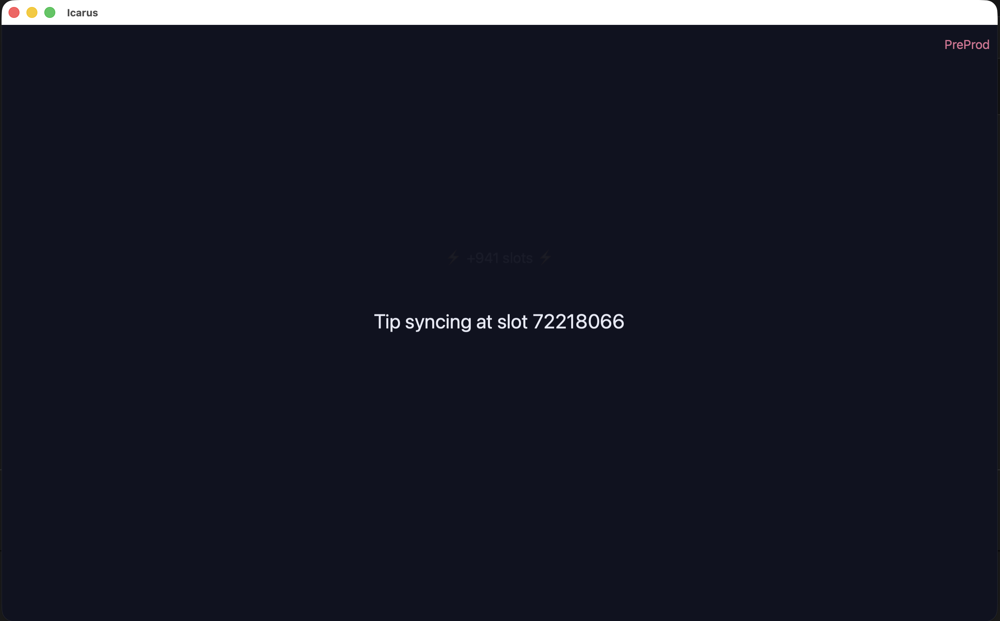

This is an experiment to have [amaru](https://amaru.global) running on desktop and mobile.
UI part is html + vanilla js.




To run the desktop demo:

```shell
npm i
npm run tauri dev
```

To run the iOS demo:

```shell
npm i
npm run tauri ios dev
```